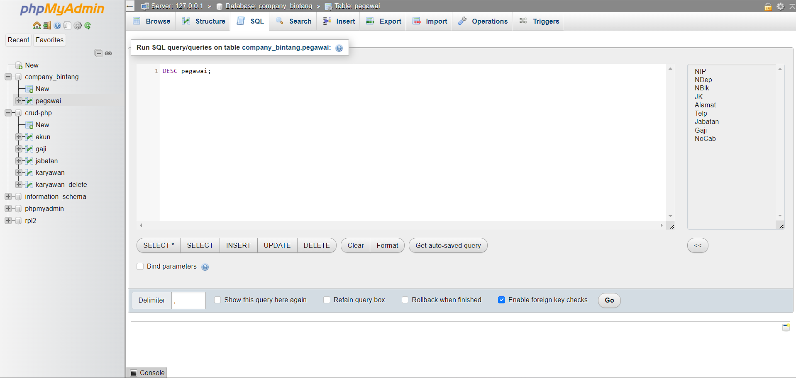

## Database 
### Apa itu Database
Database adalah kumpulan data yang terorganisir dan disimpan secara sistematis, yang memungkinkan pengambilan, pengelolaan, dan manipulasi data tersebut secara efisien. Database digunakan untuk menyimpan informasi yang dapat diakses, diubah, dan dikelola oleh aplikasi perangkat lunak.

Beberapa komponen utama dari database adalah:

1. **Tabel**: Struktur dasar untuk menyimpan data dalam baris dan kolom.
2. **Kolom (Field)**: Atribut atau tipe data tertentu dalam tabel.
3. **Baris (Record)**: Satu set nilai yang terorganisir dalam tabel, mewakili satu entitas atau objek.
4. **Kunci (Key)**: Atribut atau sekumpulan atribut yang digunakan untuk mengidentifikasi baris secara unik dalam tabel. Contoh: Primary Key dan Foreign Key.
5. **Indeks**: Struktur data yang meningkatkan kecepatan pengambilan data dari tabel.

Database bisa dikelola menggunakan Sistem Manajemen Basis Data (DBMS), seperti MySQL, PostgreSQL, Oracle Database, dan Microsoft SQL Server. DBMS memungkinkan pengguna untuk melakukan operasi seperti penambahan, pembaruan, penghapusan, dan pengambilan data dengan menggunakan bahasa query seperti SQL (Structured Query Language).

Ada berbagai jenis database, antara lain:

1. **Relasional**: Data disimpan dalam tabel yang saling terkait. Contoh: MySQL, PostgreSQL.
2. **NoSQL**: Database yang tidak menggunakan tabel relasional, cocok untuk data yang tidak terstruktur atau semi-terstruktur. Contoh: MongoDB, Cassandra.
3. **In-Memory**: Database yang menyimpan data di memori untuk akses yang sangat cepat. Contoh: Redis, Memcached.
4. **Graf**: Database yang menyimpan data dalam bentuk graf dengan simpul dan tepi. Contoh: Neo4j.

Database digunakan dalam berbagai aplikasi, mulai dari sistem perbankan, situs web, aplikasi seluler, hingga sistem manajemen perusahaan.

### Cara Membuat Database di PhpMyAdmin
Membuat database di phpMyAdmin adalah proses yang cukup sederhana dan intuitif. Berikut adalah langkah-langkah untuk membuat database di phpMyAdmin:
#### Akses phpMyAdmin
 Buka browser Anda dan ketik URL yang digunakan untuk mengakses phpMyAdmin. Biasanya, ini adalah sesuatu seperti
 ``` sql
 http://localhost/phpmyadmin
```
jika Anda bekerja di server lokal, atau domain/phpmyadmin jika di server web hosting.

Hasil Website : 


#### Buat Database Baru
- Setelah masuk, Anda akan melihat antarmuka phpMyAdmin. Di panel sebelah kiri, Anda akan melihat daftar database yang ada.
- Klik tab "New" di bagian atas halaman.


Maka tampilannya akan seperti ini :


##### Isi Nama Database
- Di halaman "Database", ada sebuah form yang meminta Anda untuk memasukkan nama database yang baru.
- Masukkan nama database yang Anda inginkan di kolom "Database name".


Disini saya memasukkan nama `Company_bintang`. yang dimana ini adalah nama database yang akan dibuat.

##### Pilih Kolasi (Collation)
- Di bawah kolom nama database, Anda bisa memilih kolasi (collation). Kolasi menentukan bagaimana teks dalam database Anda diurutkan dan dibandingkan. Jika Anda tidak yakin, Anda bisa menggunakan default value, atau memilih `utf8_general_ci` yang sering digunakan untuk berbagai bahasa.


kemudian klik create untuk membuat database baru.

Apa itu `utf8_general_ci` :
`utf8_general_ci` adalah salah satu kolasi (collation) yang digunakan dalam sistem basis data seperti MySQL untuk menentukan bagaimana string teks disimpan dan diurutkan. Mari kita uraikan maknanya:
1. **utf8**:
    - Ini menunjukkan bahwa kolasi menggunakan pengkodean karakter UTF-8. UTF-8 (8-bit Unicode Transformation Format) adalah format pengkodean karakter yang dapat mewakili setiap karakter dalam set karakter Unicode, yang mencakup hampir semua karakter yang digunakan dalam bahasa tulisan di dunia. UTF-8 sangat efisien untuk teks yang didominasi karakter ASCII dan juga dapat mewakili karakter multibyte.
2. **general**:
    - Bagian ini menentukan aturan perbandingan dan pengurutan karakter. Dalam `utf8_general_ci`, "general" menunjukkan bahwa aturan perbandingan dan pengurutan ini bersifat umum dan tidak terlalu ketat. Kolasi ini melakukan pengurutan dan perbandingan yang lebih cepat karena mengabaikan beberapa detail kecil dalam perbandingan karakter, yang mungkin penting dalam bahasa tertentu.
3. **ci**:
    - Ini adalah singkatan dari "case-insensitive" (tidak peka huruf besar/kecil). Artinya, dalam perbandingan teks, huruf besar dan kecil dianggap sama. Misalnya, "a" akan dianggap sama dengan "A" dalam perbandingan string.

Kapan Menggunakan `utf8_general_ci` :
- **Kecepatan vs. Akurasi**:
    - `utf8_general_ci` lebih cepat dalam perbandingan dan pengurutan karena menggunakan aturan umum dan tidak memperhatikan detail tertentu yang mungkin penting dalam beberapa bahasa.
- **Penggunaan Umum**:
    - Kolasi ini cocok untuk penggunaan umum di mana sensitivitas huruf besar/kecil tidak penting dan aturan perbandingan yang sangat rinci tidak diperlukan.
#### Membuat Tabel 
Untuk membuat tabel `pegawai` di MySQL dengan kolom-kolom sesuai spesifikasi yang Anda berikan, Anda dapat menggunakan perintah SQL berikut:

Program :
```sql
CREATE TABLE pegawai (
    NIP INT PRIMARY KEY,
    NDep VARCHAR(255) NOT NULL,
    NBlk VARCHAR(255),
    JK ENUM('L', 'P') NOT NULL,
    Alamat TEXT NOT NULL,
    Telp VARCHAR(20) NOT NULL,
    Jabatan ENUM('Manager', 'Staf', 'Admin'),
    Gaji BIGINT NOT NULL,
    NoCab VARCHAR(50) NOT NULL
);
```

Hasil Program : 

Kemudian Klik Go

 Penjelasan Struktur Tabel
- **NIP**: Kolom ini bertipe `INT` dan merupakan `PRIMARY KEY`, yang berarti setiap nilai di kolom ini harus unik dan tidak boleh kosong. Kolom ini akan digunakan sebagai identifikasi utama setiap baris di tabel.
- **NDep**: Kolom ini bertipe `VARCHAR(255)` dan memiliki atribut `NOT NULL`, artinya kolom ini harus diisi.
- **NBlk**: Kolom ini bertipe `VARCHAR(255)` dan tidak memiliki atribut `NOT NULL`, sehingga bisa dibiarkan kosong jika diperlukan.
- **JK**: Kolom ini bertipe `ENUM` dengan nilai yang diizinkan adalah 'L' (Laki-laki) dan 'P' (Perempuan). Kolom ini wajib diisi (`NOT NULL`).
- **Alamat**: Kolom ini bertipe `TEXT` dan memiliki atribut `NOT NULL`, sehingga harus diisi.
- **Telp**: Kolom ini bertipe `VARCHAR(20)` dan memiliki atribut `NOT NULL`, untuk menyimpan nomor telepon. Panjang maksimum 20 karakter.
- **Jabatan**: Kolom ini bertipe `ENUM` yang bisa berisi nilai-nilai seperti 'Manager', 'Staf', 'Admin'. Kolom ini tidak memiliki atribut `NOT NULL`, sehingga bisa dibiarkan kosong.
- **Gaji**: Kolom ini bertipe `BIGINT` dan memiliki atribut `NOT NULL`, untuk menyimpan nilai gaji. BIGINT dapat menyimpan angka yang sangat besar.
- **NoCab**: Kolom ini bertipe `VARCHAR(50)` dan memiliki atribut `NOT NULL`, untuk menyimpan nomor cabang atau identifikasi cabang.

#### Memasukkan Data
Untuk memasukkan data ke dalam tabel `pegawai` setelah membuatnya, Anda dapat menggunakan perintah SQL `INSERT INTO`. Berikut adalah contoh bagaimana cara memasukkan beberapa baris data ke dalam tabel `pegawai`:

Program :
```sql

INSERT INTO pegawai (NIP, NDep, NBlk, JK, Alamat, Telp, Jabatan, Gaji, NoCab)
VALUES
    (12345, 'Departemen A', 'Blok 1', 'L', 'Jalan Sepakat No. 10, Jakarta', '081234567890', 'Manager', 15000000, 'CAB01'),
    (123456, 'Departemen B', 'Blok 2', 'P', 'Jalan Maccini No. 20, Samarinda', '082345678901', 'Staf', 8000000, 'CAB02'),
    (1234567, 'Departemen C', 'Blok 3', 'L', 'Jalan Pasar Karuwisi No. 30, Makassar', '083456789012', 'Admin', 7000000, 'CAB03');
```

Hasil Program : 

Kemudian klik Go

Penjelasan :
- **NIP**: Nomor Induk Pegawai, bertipe `INT`.
- **NDep**: Nama Departemen, bertipe `VARCHAR`.
- **NBlk**: Nama Blok, bertipe `VARCHAR`.
- **JK**: Jenis Kelamin, bertipe `ENUM` dengan nilai 'L' atau 'P'.
- **Alamat**: Alamat lengkap, bertipe `TEXT`.
- **Telp**: Nomor telepon, bertipe `VARCHAR`.
- **Jabatan**: Jabatan, bertipe `ENUM` dengan nilai seperti 'Manager', 'Staf', atau 'Admin'.
- **Gaji**: Gaji pegawai, bertipe `BIGINT`.
- **NoCab**: Nomor Cabang, bertipe `VARCHAR`.

Maka data akan tersimpan di database


####  Apa itu DESC
Perintah `DESC` (atau `DESCRIBE`) adalah perintah SQL yang digunakan untuk menampilkan struktur dari tabel di database. Perintah ini memberikan informasi tentang kolom-kolom tabel, termasuk tipe data, apakah kolom tersebut dapat `NULL`, kunci (key), nilai default, dan atribut tambahan lainnya.


lalu klik Go

Maka akan muncul tampilan ini:


Output dari `DESC` : 
```sql
127.0.0.1/company_bintang/pegawai/		http://localhost/phpmyadmin/index.php?route=/table/sql&db=company_bintang&table=pegawai
Your SQL query has been executed successfully.

DESC pegawai;
NIP	int(11)	NO	PRI	NULL		
NDep	varchar(255)	NO		NULL		
NBlk	varchar(255)	YES		NULL		
JK	enum('L','P')	NO		NULL		
Alamat	text	NO		NULL		
Telp	varchar(20)	NO		NULL		
Jabatan	enum('Manager','Staf','Admin')	YES		NULL		
Gaji	bigint(20)	NO		NULL		
NoCab	varchar(50)	NO		NULL		

```

Untuk menghasilkan code diatas caranya : 

Menekan **Copy To Clipboard.**

Berikut adalah kolom-kolom yang umumnya ditampilkan oleh perintah `DESC`:
1. **Field**: Nama kolom dalam tabel.
2. **Type**: Tipe data dari kolom (misalnya, INT, VARCHAR, DATE).
3. **Null**: Menunjukkan apakah kolom dapat berisi nilai NULL (`YES` atau `NO`).
4. **Key**: Menunjukkan apakah kolom merupakan bagian dari kunci utama (PRIMARY KEY), kunci unik (UNIQUE), atau indeks biasa (INDEX). Biasanya ditandai dengan `PRI`, `UNI`, atau `MUL`.
5. **Default**: Nilai default yang akan digunakan jika tidak ada nilai yang diberikan untuk kolom tersebut.
6. **Extra**: Informasi tambahan tentang kolom (misalnya, `AUTO_INCREMENT` untuk kolom yang nilainya bertambah otomatis).

#### Apa itu Select
Perintah `SELECT` adalah salah satu perintah SQL yang paling dasar dan penting. Digunakan untuk mengambil data dari satu atau lebih tabel dalam database. Hasil dari perintah `SELECT` biasanya berupa hasil query yang bisa Anda lihat dalam bentuk tabel, dan ini adalah cara utama untuk membaca atau mengakses data yang telah disimpan di database.

Program : 
```sql
SELECT * FROM 'pegawai';
```

Tampilan Program : 

Kemudian klik Go.

Setelah menjalankan perintah, phpMyAdmin akan menampilkan hasil data dari tabel `pegawai`. Salin hasil dari tampilan tersebut.


``` sql
127.0.0.1/company_bintang/pegawai/		http://localhost/phpmyadmin/index.php?route=/table/sql&db=company_bintang&table=pegawai

   Showing rows 0 -  2 (3 total, Query took 0.0005 seconds.)


SELECT * FROM pegawai;


NIP	NDep	NBlk	JK	Alamat	Telp	Jabatan	Gaji	NoCab	
12345	Departemen A	Blok 1	L	Jalan Sepakat No. 10, Jakarta	081234567890	Manager	15000000	CAB01	
123456	Departemen B	Blok 2	P	Jalan Maccini No. 20, Samarinda	082345678901	Staf	8000000	CAB02	
1234567	Departemen C	Blok 3	L	Jalan Pasar Karuwisi No. 30, Makassar	083456789012	Admin	7000000	CAB03	

```

Penjelasan : 
- **`SELECT *`**: Mengambil semua kolom dari tabell
Perintah `SELECT` memungkinkan Anda untuk memanipulasi dan menganalisis data yang disimpan dalam database dengan cara yang sangat fleksibel dan kuat.