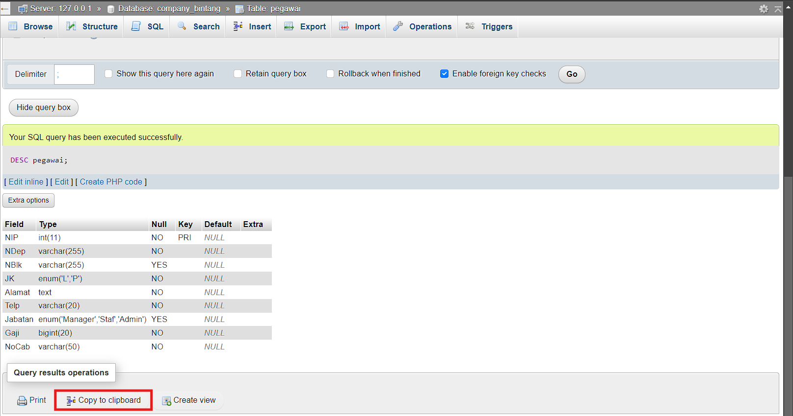

## Database 
### Apa itu Database
Database adalah kumpulan data yang terorganisir dan disimpan secara sistematis, yang memungkinkan pengambilan, pengelolaan, dan manipulasi data tersebut secara efisien. Database digunakan untuk menyimpan informasi yang dapat diakses, diubah, dan dikelola oleh aplikasi perangkat lunak.

Beberapa komponen utama dari database adalah:

1. **Tabel**: Struktur dasar untuk menyimpan data dalam baris dan kolom.
2. **Kolom (Field)**: Atribut atau tipe data tertentu dalam tabel.
3. **Baris (Record)**: Satu set nilai yang terorganisir dalam tabel, mewakili satu entitas atau objek.
4. **Kunci (Key)**: Atribut atau sekumpulan atribut yang digunakan untuk mengidentifikasi baris secara unik dalam tabel. Contoh: Primary Key dan Foreign Key.
5. **Indeks**: Struktur data yang meningkatkan kecepatan pengambilan data dari tabel.

Database bisa dikelola menggunakan Sistem Manajemen Basis Data (DBMS), seperti MySQL, PostgreSQL, Oracle Database, dan Microsoft SQL Server. DBMS memungkinkan pengguna untuk melakukan operasi seperti penambahan, pembaruan, penghapusan, dan pengambilan data dengan menggunakan bahasa query seperti SQL (Structured Query Language).

Ada berbagai jenis database, antara lain:

1. **Relasional**: Data disimpan dalam tabel yang saling terkait. Contoh: MySQL, PostgreSQL.
2. **NoSQL**: Database yang tidak menggunakan tabel relasional, cocok untuk data yang tidak terstruktur atau semi-terstruktur. Contoh: MongoDB, Cassandra.
3. **In-Memory**: Database yang menyimpan data di memori untuk akses yang sangat cepat. Contoh: Redis, Memcached.
4. **Graf**: Database yang menyimpan data dalam bentuk graf dengan simpul dan tepi. Contoh: Neo4j.

Database digunakan dalam berbagai aplikasi, mulai dari sistem perbankan, situs web, aplikasi seluler, hingga sistem manajemen perusahaan.

### Cara Membuat Database di PhpMyAdmin
Membuat database di phpMyAdmin adalah proses yang cukup sederhana dan intuitif. Berikut adalah langkah-langkah untuk membuat database di phpMyAdmin:
#### Akses phpMyAdmin
 Buka browser Anda dan ketik URL yang digunakan untuk mengakses phpMyAdmin. Biasanya, ini adalah sesuatu seperti
 ``` sql
 http://localhost/phpmyadmin
```
jika Anda bekerja di server lokal, atau domain/phpmyadmin jika di server web hosting.

Hasil Website : 


#### Buat Database Baru
- Setelah masuk, Anda akan melihat antarmuka phpMyAdmin. Di panel sebelah kiri, Anda akan melihat daftar database yang ada.
- Klik tab "New" di bagian atas halaman.


Maka tampilannya akan seperti ini :


##### Isi Nama Database
- Di halaman "Database", ada sebuah form yang meminta Anda untuk memasukkan nama database yang baru.
- Masukkan nama database yang Anda inginkan di kolom "Database name".


Disini saya memasukkan nama `Company_bintang`. yang dimana ini adalah nama database yang akan dibuat.

##### Pilih Kolasi (Collation)
- Di bawah kolom nama database, Anda bisa memilih kolasi (collation). Kolasi menentukan bagaimana teks dalam database Anda diurutkan dan dibandingkan. Jika Anda tidak yakin, Anda bisa menggunakan default value, atau memilih `utf8_general_ci` yang sering digunakan untuk berbagai bahasa.


kemudian klik create untuk membuat database baru.

Apa itu `utf8_general_ci` :
`utf8_general_ci` adalah salah satu kolasi (collation) yang digunakan dalam sistem basis data seperti MySQL untuk menentukan bagaimana string teks disimpan dan diurutkan. Mari kita uraikan maknanya:
1. **utf8**:
    - Ini menunjukkan bahwa kolasi menggunakan pengkodean karakter UTF-8. UTF-8 (8-bit Unicode Transformation Format) adalah format pengkodean karakter yang dapat mewakili setiap karakter dalam set karakter Unicode, yang mencakup hampir semua karakter yang digunakan dalam bahasa tulisan di dunia. UTF-8 sangat efisien untuk teks yang didominasi karakter ASCII dan juga dapat mewakili karakter multibyte.
2. **general**:
    - Bagian ini menentukan aturan perbandingan dan pengurutan karakter. Dalam `utf8_general_ci`, "general" menunjukkan bahwa aturan perbandingan dan pengurutan ini bersifat umum dan tidak terlalu ketat. Kolasi ini melakukan pengurutan dan perbandingan yang lebih cepat karena mengabaikan beberapa detail kecil dalam perbandingan karakter, yang mungkin penting dalam bahasa tertentu.
3. **ci**:
    - Ini adalah singkatan dari "case-insensitive" (tidak peka huruf besar/kecil). Artinya, dalam perbandingan teks, huruf besar dan kecil dianggap sama. Misalnya, "a" akan dianggap sama dengan "A" dalam perbandingan string.

Kapan Menggunakan `utf8_general_ci` :
- **Kecepatan vs. Akurasi**:
    - `utf8_general_ci` lebih cepat dalam perbandingan dan pengurutan karena menggunakan aturan umum dan tidak memperhatikan detail tertentu yang mungkin penting dalam beberapa bahasa.
- **Penggunaan Umum**:
    - Kolasi ini cocok untuk penggunaan umum di mana sensitivitas huruf besar/kecil tidak penting dan aturan perbandingan yang sangat rinci tidak diperlukan.
#### Membuat Tabel 
Untuk membuat tabel `pegawai` di MySQL dengan kolom-kolom sesuai spesifikasi yang Anda berikan, Anda dapat menggunakan perintah SQL berikut:

Program :
```sql
CREATE TABLE pegawai (
    NIP INT PRIMARY KEY,
    NDep VARCHAR(255) NOT NULL,
    NBlk VARCHAR(255),
    JK ENUM('L', 'P') NOT NULL,
    Alamat TEXT NOT NULL,
    Telp VARCHAR(20) NOT NULL,
    Jabatan ENUM('Manager', 'Staf', 'Admin'),
    Gaji BIGINT NOT NULL,
    NoCab VARCHAR(50) NOT NULL
);
```

Hasil Program : 

Kemudian Klik Go

Penjelasan Struktur Tabel :

NIP: `INT` & `PRIMARY KEY`
**Tipe Data**: `INT` (Integer) digunakan untuk menyimpan angka bulat, yang cocok untuk nomor identifikasi pegawai.
**PRIMARY KEY**: `PRIMARY KEY` adalah atribut yang menjadikan kolom ini sebagai pengidentifikasi unik untuk setiap baris dalam tabel. Tidak ada dua baris yang dapat memiliki nilai `NIP` yang sama, dan kolom ini tidak boleh `NULL`. Oleh karena itu, setiap pegawai harus memiliki NIP yang unik.

**NDep: `VARCHAR` & `NOT NULL`**
**Tipe Data**: `VARCHAR` digunakan untuk menyimpan teks dengan panjang variabel. Kolom ini menyimpan nama departemen, yang bervariasi dalam panjang.
**NOT NULL**: Kolom ini ditetapkan sebagai `NOT NULL` karena setiap pegawai harus terkait dengan suatu departemen. Departemen harus selalu diisi, sehingga nilai `NULL` tidak diizinkan.

**NBlk: `VARCHAR`**
**Tipe Data**: `VARCHAR` digunakan untuk menyimpan teks dengan panjang variabel. Kolom ini bisa menyimpan nama blok atau unit kerja, yang bisa berbeda panjangnya.
**NULL**: Kolom ini tidak memiliki atribut `NOT NULL`, yang berarti bisa dibiarkan kosong (`NULL`) jika informasi blok tidak relevan atau tidak tersedia untuk pegawai tertentu.

**JK: `ENUM` & `NOT NULL`**
**Tipe Data**: `ENUM` digunakan untuk menyimpan data dengan nilai yang telah ditentukan sebelumnya, dalam hal ini 'L' (Laki-laki) atau 'P' (Perempuan). `ENUM` membantu memastikan data yang disimpan dalam kolom ini hanya salah satu dari nilai yang diizinkan.
**NOT NULL**: Kolom ini ditetapkan sebagai `NOT NULL` karena jenis kelamin pegawai harus selalu diketahui dan diisi.

**Alamat: `TEXT` & `NOT NULL`**
**Tipe Data**: `TEXT` digunakan untuk menyimpan teks yang lebih panjang, seperti alamat lengkap pegawai.
**NOT NULL**: Kolom ini ditetapkan sebagai `NOT NULL` karena alamat harus selalu ada untuk setiap pegawai. Alamat digunakan untuk keperluan komunikasi dan dokumentasi, sehingga tidak boleh kosong.

**Telp: `VARCHAR` & `NOT NULL`**
**Tipe Data**: `VARCHAR` digunakan untuk menyimpan nomor telepon, yang biasanya berupa serangkaian angka dan mungkin juga tanda plus (+) untuk kode negara.
**NOT NULL**: Kolom ini ditetapkan sebagai `NOT NULL` karena nomor telepon adalah informasi penting untuk menghubungi pegawai. Nomor telepon harus selalu ada, jadi tidak boleh kosong.

**Jabatan: `ENUM`**
**Tipe Data**: `ENUM` digunakan untuk menyimpan nilai yang telah ditentukan sebelumnya, misalnya 'Manager', 'Staf', 'Admin'. `ENUM` memastikan bahwa hanya jabatan yang valid yang dapat dimasukkan.
**NULL**: Kolom ini tidak memiliki atribut `NOT NULL`, sehingga bisa dibiarkan kosong (`NULL`) jika jabatan belum ditentukan atau jika informasi ini tidak wajib diisi pada saat tertentu.

**Gaji: `BIGINT` & `NOT NULL`**
**Tipe Data**: `BIGINT` digunakan untuk menyimpan angka yang sangat besar, seperti gaji pegawai. `BIGINT` memastikan bahwa bahkan jumlah gaji yang besar dapat disimpan tanpa masalah.
**NOT NULL**: Kolom ini ditetapkan sebagai `NOT NULL` karena setiap pegawai harus memiliki informasi gaji. Gaji adalah data penting dalam pengelolaan kepegawaian, sehingga nilainya tidak boleh kosong.

**NoCab: `VARCHAR` & `NOT NULL`**
**Tipe Data**: `VARCHAR` digunakan untuk menyimpan nomor cabang atau kode cabang, yang bisa berupa kombinasi angka dan huruf.
**NOT NULL**: Kolom ini ditetapkan sebagai `NOT NULL` karena setiap pegawai harus terhubung dengan cabang tertentu. Nomor cabang atau identifikasi cabang adalah informasi penting yang harus selalu ada.

Ringkasan Alasan untuk `NOT NULL`
**Keberadaan Data yang Penting**: Kolom yang ditetapkan sebagai `NOT NULL` menunjukkan bahwa data tersebut dianggap penting dan harus selalu ada untuk setiap entri. Misalnya, nama departemen, jenis kelamin, alamat, nomor telepon, gaji, dan nomor cabang adalah informasi yang sangat penting dan diperlukan untuk operasi sehari-hari, pelaporan, dan administrasi pegawai.
**Integritas Data**: Penggunaan `NOT NULL` memastikan integritas data, mencegah kekosongan atau data yang hilang pada kolom-kolom yang esensial, yang bisa menyebabkan masalah operasional atau pelaporan.

#### Memasukkan Data
Untuk memasukkan data ke dalam tabel `pegawai` setelah membuatnya, Anda dapat menggunakan perintah SQL `INSERT INTO`. Berikut adalah contoh bagaimana cara memasukkan beberapa baris data ke dalam tabel `pegawai`:

Program :
```sql

INSERT INTO pegawai (NIP, NDep, NBlk, JK, Alamat, Telp, Jabatan, Gaji, NoCab)
VALUES
    (12345, 'Departemen A', 'Blok 1', 'L', 'Jalan Sepakat No. 10, Jakarta', '081234567890', 'Manager', 15000000, 'CAB01'),
    (123456, 'Departemen B', 'Blok 2', 'P', 'Jalan Maccini No. 20, Samarinda', '082345678901', 'Staf', 8000000, 'CAB02'),
    (1234567, 'Departemen C', 'Blok 3', 'L', 'Jalan Pasar Karuwisi No. 30, Makassar', '083456789012', 'Admin', 7000000, 'CAB03');
```

Hasil Program : 

Kemudian klik Go

Penjelasan :
- **NIP**: Nomor Induk Pegawai, bertipe `INT`.
- **NDep**: Nama Departemen, bertipe `VARCHAR`.
- **NBlk**: Nama Blok, bertipe `VARCHAR`.
- **JK**: Jenis Kelamin, bertipe `ENUM` dengan nilai 'L' atau 'P'.
- **Alamat**: Alamat lengkap, bertipe `TEXT`.
- **Telp**: Nomor telepon, bertipe `VARCHAR`.
- **Jabatan**: Jabatan, bertipe `ENUM` dengan nilai seperti 'Manager', 'Staf', atau 'Admin'.
- **Gaji**: Gaji pegawai, bertipe `BIGINT`.
- **NoCab**: Nomor Cabang, bertipe `VARCHAR`.

Maka data akan tersimpan di database


####  Apa itu DESC
Perintah `DESC` (atau `DESCRIBE`) adalah perintah SQL yang digunakan untuk menampilkan struktur dari tabel di database. Perintah ini memberikan informasi tentang kolom-kolom tabel, termasuk tipe data, apakah kolom tersebut dapat `NULL`, kunci (key), nilai default, dan atribut tambahan lainnya.


lalu klik Go

Maka akan muncul tampilan ini:


Output dari `DESC` : 
```sql
127.0.0.1/company_bintang/pegawai/		http://localhost/phpmyadmin/index.php?route=/table/sql&db=company_bintang&table=pegawai
Your SQL query has been executed successfully.

DESC pegawai;
NIP	int(11)	NO	PRI	NULL		
NDep	varchar(255)	NO		NULL		
NBlk	varchar(255)	YES		NULL		
JK	enum('L','P')	NO		NULL		
Alamat	text	NO		NULL		
Telp	varchar(20)	NO		NULL		
Jabatan	enum('Manager','Staf','Admin')	YES		NULL		
Gaji	bigint(20)	NO		NULL		
NoCab	varchar(50)	NO		NULL		

```

Untuk menghasilkan code diatas caranya : 

Menekan **Copy To Clipboard.**

Berikut adalah kolom-kolom yang umumnya ditampilkan oleh perintah `DESC`:
1. **Field**: Nama kolom dalam tabel.
2. **Type**: Tipe data dari kolom (misalnya, INT, VARCHAR, DATE).
3. **Null**: Menunjukkan apakah kolom dapat berisi nilai NULL (`YES` atau `NO`).
4. **Key**: Menunjukkan apakah kolom merupakan bagian dari kunci utama (PRIMARY KEY), kunci unik (UNIQUE), atau indeks biasa (INDEX). Biasanya ditandai dengan `PRI`, `UNI`, atau `MUL`.
5. **Default**: Nilai default yang akan digunakan jika tidak ada nilai yang diberikan untuk kolom tersebut.
6. **Extra**: Informasi tambahan tentang kolom (misalnya, `AUTO_INCREMENT` untuk kolom yang nilainya bertambah otomatis).

#### Apa itu Select
Perintah `SELECT` adalah salah satu perintah SQL yang paling dasar dan penting. Digunakan untuk mengambil data dari satu atau lebih tabel dalam database. Hasil dari perintah `SELECT` biasanya berupa hasil query yang bisa Anda lihat dalam bentuk tabel, dan ini adalah cara utama untuk membaca atau mengakses data yang telah disimpan di database.

Program : 
```sql
SELECT * FROM 'pegawai';
```

Tampilan Program : 

Kemudian klik Go.

Setelah menjalankan perintah, phpMyAdmin akan menampilkan hasil data dari tabel `pegawai`. Salin hasil dari tampilan tersebut.


``` sql
127.0.0.1/company_bintang/pegawai/		http://localhost/phpmyadmin/index.php?route=/table/sql&db=company_bintang&table=pegawai

   Showing rows 0 -  2 (3 total, Query took 0.0005 seconds.)


SELECT * FROM pegawai;


NIP	NDep	NBlk	JK	Alamat	Telp	Jabatan	Gaji	NoCab	
12345	Departemen A	Blok 1	L	Jalan Sepakat No. 10, Jakarta	081234567890	Manager	15000000	CAB01	
123456	Departemen B	Blok 2	P	Jalan Maccini No. 20, Samarinda	082345678901	Staf	8000000	CAB02	
1234567	Departemen C	Blok 3	L	Jalan Pasar Karuwisi No. 30, Makassar	083456789012	Admin	7000000	CAB03	

```

Penjelasan : 
- **`SELECT *`**: Mengambil semua kolom dari tabell
Perintah `SELECT` memungkinkan Anda untuk memanipulasi dan menganalisis data yang disimpan dalam database dengan cara yang sangat fleksibel dan kuat.


## Contoh Peng-aplikasian Query Select
### 1. 
`SELECT` adalah salah satu perintah paling mendasar dalam SQL (Structured Query Language) yang digunakan untuk mengambil data dari satu atau lebih tabel di dalam database. Dengan perintah `SELECT`, Anda bisa menentukan kolom mana yang ingin diambil, mengatur bagaimana data ditampilkan, serta menerapkan filter dan kondisi untuk memilih data yang spesifik.

Program :
```SQL
SELECT 
    COUNT(NIP) AS jumlahPegawai, 
    COUNT(Jabatan) AS jumlahJabatan 
FROM 
    pegawai;
```

Hasil Program : 

Hasil Console :
```sql
| jumlahPegawai | jumlahJabatan |
| ------------- | ------------- |
| 3             | 3             |
```

#### Penjelasan Hasil

- **`jumlahPegawai = 3`**: Ini menunjukkan bahwa ada 3 pegawai di tabel.
- **`jumlahJabatan = 3`**: Ini menunjukkan bahwa ada 3 pegawai yang memiliki jabatan yang diisi (`Manager` `admin` dan `Staf`). Pegawai ketiga tidak dihitung dalam `jumlahJabatan` karena kolom `Jabatan` miliknya bernilai `NULL`.

- **`COUNT(NIP)`** akan menghitung jumlah total baris di tabel `pegawai` di mana `NIP` tidak `NULL`, yang biasanya merupakan jumlah pegawai karena `NIP` adalah `PRIMARY KEY` dan tidak mungkin `NULL`.

- **`COUNT(Jabatan)`** akan menghitung jumlah baris di mana kolom `Jabatan` tidak `NULL`. Jika ada pegawai yang tidak memiliki jabatan (yaitu, `Jabatan` bernilai `NULL`), mereka tidak akan dihitung.

#### Penjelasan Query

- **`SELECT`**: Memulai query untuk memilih data dari tabel.
- **`COUNT(NIP)`**: Menghitung jumlah baris dalam tabel `pegawai` di mana kolom `NIP` tidak `NULL`. Ini biasanya akan menghitung semua pegawai, karena `NIP` adalah `PRIMARY KEY` dan tidak pernah `NULL`.
- **`AS jumlahPegawai`**: Memberikan alias `jumlahPegawai` untuk hasil dari `COUNT(NIP)` agar lebih mudah dibaca dalam hasil query.
- **`COUNT(Jabatan)`**: Menghitung jumlah baris dalam tabel `pegawai` di mana kolom `Jabatan` tidak `NULL`. Hasilnya adalah jumlah pegawai yang memiliki jabatan yang diisi.
- **`AS jumlahJabatan`**: Memberikan alias `jumlahJabatan` untuk hasil dari `COUNT(Jabatan)` agar lebih mudah dibaca dalam hasil query.
- **`FROM pegawai`**: Menentukan tabel `pegawai` sebagai sumber data.

### 2. 

Contoh Program :
```sql
SELECT COUNT(NIP) AS jumlahPegawai 
FROM pegawai 
WHERE NoCab = 'CAB01';
```

Hasil Program : 

Hasil Console : 
```sql
|jumlahPegawai|
|2            |
```
#### Penjelasan Setiap Bagian dari Query

1. **`SELECT COUNT(NIP)`**:
    
    - **`SELECT`**: Digunakan untuk memilih data dari database.
    - **`COUNT(NIP)`**: `COUNT` adalah fungsi agregat dalam SQL yang digunakan untuk menghitung jumlah baris yang memenuhi kondisi tertentu. Dalam hal ini, `COUNT(NIP)` akan menghitung jumlah baris di mana kolom `NIP` tidak `NULL`. Karena `NIP` adalah `PRIMARY KEY`, maka setiap `NIP` pasti unik dan tidak `NULL`, sehingga ini menghitung jumlah total pegawai yang memenuhi kondisi di klausa `WHERE`.
    
2. **`AS jumlahPegawai`**:
    
    - `AS` digunakan untuk memberi alias pada hasil dari `COUNT(NIP)`. Alias `jumlahPegawai` adalah nama kolom baru yang akan ditampilkan dalam hasil query, yang menyimpan hasil dari fungsi `COUNT`. Ini membuat hasil lebih mudah dibaca dan dipahami.
    
3. **`FROM pegawai`**:
    
    - `FROM` menentukan tabel dari mana data akan diambil, yaitu tabel `pegawai` dalam hal ini.
    
4. **`WHERE NoCab = 'CAB01'`**:
    
    - `WHERE` adalah klausa yang digunakan untuk menyaring data. Ini memastikan bahwa hanya baris yang memenuhi kondisi tertentu yang akan dihitung atau ditampilkan.
    - `NoCab = 'CAB01'` adalah kondisi yang memfilter data berdasarkan kolom `NoCab`. Hanya pegawai yang bekerja di cabang dengan kode 'CAB01' yang akan dihitung.

### 3.
``` sql
SELECT NoCab, COUNT(NIP) AS jumlah_pegawai 
FROM pegawai 
GROUP BY NoCab;
```

#### Penjelasan Setiap Bagian dari Query

1. **`SELECT NoCab, COUNT(NIP) AS jumlah_pegawai`**:
    - **`SELECT`**: Perintah ini digunakan untuk memilih data dari tabel dalam database.
    - **`NoCab`**: Ini adalah kolom yang mewakili kode cabang dari mana pegawai bekerja. Kita memilih kolom ini untuk ditampilkan dalam hasil query.
    - **`COUNT(NIP)`**: Fungsi agregat `COUNT` menghitung jumlah baris dalam grup tertentu di mana kolom `NIP` tidak `NULL`. Karena `NIP` adalah `PRIMARY KEY`, ini akan menghitung jumlah pegawai di setiap cabang.
    - **`AS jumlah_pegawai`**: Alias ini memberikan nama yang lebih deskriptif pada hasil dari `COUNT(NIP)`. Nama kolom hasil akan menjadi `jumlah_pegawai`, yang menunjukkan jumlah pegawai di setiap cabang.
2. **`FROM pegawai`**:
    - Menunjukkan dari tabel mana data akan diambil, dalam hal ini dari tabel `pegawai`.
3. **`GROUP BY NoCab`**:
    - Klausa `GROUP BY` digunakan untuk mengelompokkan hasil query berdasarkan satu atau lebih kolom. Dalam hal ini, data dikelompokkan berdasarkan kolom `NoCab`.
    - Setelah data dikelompokkan berdasarkan `NoCab`, fungsi agregat `COUNT(NIP)` akan diterapkan untuk menghitung jumlah pegawai di setiap kelompok atau cabang.

Hasil Program :


Hasil Console :
```sql
|NoCab|jumlah_pegawai|
|---|---|
|CAB01|1|
|CAB02|1|
|CAB03|1|
```

#### Penjelasan Hasil

- **`CAB01` dengan `jumlah_pegawai = 1`**: Ini menunjukkan bahwa ada 1 pegawai yang bekerja di cabang dengan kode 'CAB01'.
- **`CAB02` dengan `jumlah_pegawai = 1`**: Ini menunjukkan bahwa ada 1 pegawai yang bekerja di cabang dengan kode 'CAB02'.
-  **`CAB02` dengan `jumlah_pegawai = 1`**: Ini menunjukkan bahwa ada 1 pegawai yang bekerja di cabang dengan kode 'CAB03'.

#### Fungsi `GROUP BY`

- **`GROUP BY`** digunakan untuk mengelompokkan baris dengan nilai yang sama dalam kolom tertentu. Setelah data dikelompokkan, Anda dapat menerapkan fungsi agregat seperti `COUNT`, `SUM`, `AVG`, dll., untuk setiap kelompok tersebut.

#### Kegunaan dan Relevansi

- **Analisis Data**: Query ini berguna untuk menghitung jumlah pegawai di setiap cabang, yang bisa digunakan untuk analisis sumber daya manusia, distribusi pegawai, dan pelaporan.
- **Penyajian Data yang Terstruktur**: Dengan menggunakan `GROUP BY`, data yang terkait dapat dikelompokkan dan ditampilkan dengan cara yang lebih terstruktur dan mudah dipahami. Misalnya, mengetahui berapa banyak pegawai di setiap cabang dapat membantu dalam pengambilan keputusan terkait alokasi sumber daya atau strategi bisnis.

### 4.

Program :
```sql
SELECT NoCab, COUNT(NIP) AS jumlah_pegawai 
FROM pegawai 
GROUP BY NoCab 
HAVING COUNT(NIP) >= 3;
```

**Penjelasan Setiap Bagian dari Query

1. **`SELECT NoCab, COUNT(NIP) AS jumlah_pegawai`**:
    - **`SELECT`**: Digunakan untuk memilih data dari database.
    - **`NoCab`**: Kolom `NoCab` yang mewakili kode cabang, diambil untuk ditampilkan dalam hasil.
    - **`COUNT(NIP) AS jumlah_pegawai`**: `COUNT(NIP)` menghitung jumlah pegawai (`NIP`) yang bekerja di setiap cabang (`NoCab`). Alias `jumlah_pegawai` digunakan untuk memberikan nama yang lebih deskriptif pada hasil perhitungan.
2. **`FROM pegawai`**:
    - `FROM` menentukan tabel dari mana data diambil, yaitu tabel `pegawai`.
3. **`GROUP BY NoCab`**:
    - **`GROUP BY`**: Klausa yang digunakan untuk mengelompokkan baris hasil query berdasarkan kolom tertentu. Dalam hal ini, baris-baris akan dikelompokkan berdasarkan `NoCab`, sehingga hasil query akan menampilkan satu baris per cabang (`NoCab`), bersama dengan jumlah pegawai di cabang tersebut.
4. **`HAVING COUNT(NIP) >= 3`**:
    - **`HAVING`**: Klausa yang digunakan untuk menyaring hasil setelah pengelompokan (`GROUP BY`). Ini mirip dengan klausa `WHERE`, tetapi digunakan pada agregat hasil pengelompokan.
    - `COUNT(NIP) >= 3`: Kondisi yang menyaring cabang hanya jika jumlah pegawai di cabang tersebut adalah 3 atau lebih.

**Cara Kerja Query

1. **Mengelompokkan Data**: Query pertama-tama mengelompokkan semua data dalam tabel `pegawai` berdasarkan kolom `NoCab` (kode cabang).
2. **Menghitung Jumlah Pegawai per Cabang**: Untuk setiap grup (cabang), query menghitung jumlah pegawai (`NIP`) yang terdaftar dalam cabang tersebut menggunakan `COUNT(NIP)`.
3. **Menyaring Hasil**: Hanya cabang-cabang yang memiliki 3 atau lebih pegawai yang akan ditampilkan dalam hasil akhir, sesuai dengan kondisi `HAVING COUNT(NIP) >= 3`.

Hasil Program : 


Hasil Console :
```sql
|NoCab|jumlah_pegawai|
|---|---|
|CAB01|3|
```

#### Penjelasan Hasil

- **`CAB01`**: Cabang dengan kode `CAB01` memiliki 3 pegawai. Karena ini memenuhi kondisi `HAVING COUNT(NIP) >= 3`, cabang ini ditampilkan dalam hasil.
- **Cabang `CAB02` tidak muncul**: Karena hanya memiliki 2 pegawai, maka cabang ini tidak memenuhi kondisi `HAVING COUNT(NIP) >= 3`.

### 5.
```sql
SELECT SUM(Gaji) AS total_gaji 
FROM pegawai;
```
#### Penjelasan Setiap Bagian dari Query

1. **`SELECT SUM(Gaji)`**:
    - **`SELECT`**: Digunakan untuk memilih data dari database.
    - **`SUM(Gaji)`**: `SUM` adalah fungsi agregat dalam SQL yang digunakan untuk menjumlahkan nilai-nilai numerik dalam kolom tertentu. Dalam hal ini, `SUM(Gaji)` akan menjumlahkan semua nilai dalam kolom `Gaji` dari tabel `pegawai`.
2. **`AS total_gaji`**:
    - `AS` digunakan untuk memberi alias pada hasil dari `SUM(Gaji)`. Alias `total_gaji` akan menjadi nama kolom dalam hasil query, yang menunjukkan jumlah total gaji.
3. **`FROM pegawai`**:
    - `FROM` menentukan tabel dari mana data diambil, yaitu tabel `pegawai`.

Hasil Program : 

Penjelasan Hasil
- **`total_gaji = 30000000`**: Ini menunjukkan bahwa jumlah total gaji dari semua pegawai yang tercatat dalam tabel `pegawai` adalah 30 juta.
Fungsi `SUM`
- **`SUM`** adalah fungsi agregat dalam SQL yang digunakan untuk menjumlahkan nilai dari kolom numerik. Ini sangat berguna dalam skenario di mana Anda perlu menghitung total dari berbagai nilai, seperti total penjualan, total pengeluaran, atau, dalam kasus ini, total gaji karyawan.

### 6.
Program : 
```sql
SELECT SUM(Gaji) AS gaji_staff 
FROM pegawai 
WHERE Jabatan = 'Staf';
```
#### Penjelasan Setiap Bagian dari Query

1. **`SELECT SUM(Gaji)`**:
    - **`SUM(Gaji)`**: `SUM` adalah fungsi agregat yang menjumlahkan semua nilai dalam kolom `Gaji` untuk baris yang memenuhi kondisi `WHERE`. Dalam hal ini, hanya gaji dari pegawai yang memiliki jabatan "Staff" yang akan dijumlahkan.
    - **`AS gaji_staff`**: Memberikan alias `gaji_staff` untuk hasil dari `SUM(Gaji)`, yang akan menjadi nama kolom dalam hasil query.
2. **`FROM pegawai`**:
    - Menentukan tabel `pegawai` sebagai sumber data.
3. **`WHERE Jabatan = 'Staf'`**:
    - `WHERE` adalah klausa yang digunakan untuk menyaring data. Hanya baris di mana kolom `Jabatan` bernilai "Staff" yang akan dipertimbangkan dalam perhitungan.

Hasil Program : 
Penjelasan Hasil
- **`gaji_staff = 8000000`**: Ini menunjukkan bahwa total gaji dari semua pegawai yang memiliki jabatan "Staff" adalah 8 juta.

### 7. 
```sql
SELECT NoCab, SUM(Gaji) AS TotalGaji 
FROM pegawai 
GROUP BY NoCab;
```

Hasil Program : 


**Penjelasan Query**
- **SELECT NoCab, SUM(Gaji) AS TotalGaji**:
    - **NoCab**: Memilih kolom `NoCab`, yaitu nomor cabang, untuk ditampilkan dalam hasil query.
    - **SUM(Gaji) AS TotalGaji**: Menghitung total gaji (`SUM(Gaji)`) dari semua pegawai yang terkait dengan setiap cabang, dan memberi nama hasilnya sebagai `TotalGaji`.
- **FROM pegawai**:
    - Menentukan tabel `pegawai` sebagai sumber data.
- **GROUP BY NoCab**:
    - Mengelompokkan hasil berdasarkan kolom `NoCab`, sehingga total gaji dihitung untuk setiap cabang secara terpisah.

Penjelasan Konteks
- **Mengapa NoCab Digunakan dalam GROUP BY**: `NoCab` adalah nomor cabang yang digunakan untuk mengelompokkan data berdasarkan cabang yang berbeda. Ini penting untuk mengetahui total gaji yang harus dibayarkan untuk setiap cabang secara individu.
- **Mengapa SUM(Gaji)**: Fungsi `SUM` digunakan untuk menjumlahkan nilai gaji dari semua pegawai dalam satu cabang. Ini memberikan gambaran tentang total biaya gaji untuk setiap cabang, yang penting untuk pengelolaan anggaran dan keuangan perusahaan.

### 8.

Program : 
```sql
SELECT NoCab, SUM(Gaji) AS Total_Gaji 
FROM pegawai 
GROUP BY NoCab 
HAVING SUM(Gaji) >= 8000000;
```

**Penjelasan Query

- **SELECT NoCab, SUM(Gaji) AS Total_Gaji**:
    - **NoCab**: Memilih kolom `NoCab`, yaitu nomor cabang, untuk ditampilkan dalam hasil query.
    - **SUM(Gaji) AS Total_Gaji**: Menghitung total gaji (`SUM(Gaji)`) dari semua pegawai yang terkait dengan setiap cabang, dan memberi nama hasilnya sebagai `Total_Gaji`.
- **FROM pegawai**:
    - Menentukan tabel `pegawai` sebagai sumber data.
- **GROUP BY NoCab**:
    - Mengelompokkan hasil berdasarkan kolom `NoCab`, sehingga total gaji dihitung untuk setiap cabang secara terpisah.
- **HAVING SUM(Gaji) >= 1000000**:
    - Filter ini memastikan hanya cabang-cabang yang memiliki total gaji minimal 8.000.000 yang akan ditampilkan dalam hasil query.

 Penjelasan Konteks
- **Mengapa Menggunakan HAVING**:
    - `HAVING` digunakan setelah `GROUP BY` untuk memfilter kelompok data berdasarkan hasil agregasi. Dalam hal ini, `HAVING` memfilter hasil untuk hanya menampilkan cabang-cabang dengan total gaji sama dengan atau lebih besar dari 1.000.000.
- **Mengapa SUM(Gaji) >= 1000000**:
    - Kondisi ini digunakan untuk menemukan cabang-cabang yang mengeluarkan biaya gaji besar, sehingga dapat difokuskan untuk analisis atau keputusan bisnis yang berkaitan dengan pengelolaan biaya.

Hasil Program : 


**Penjelasan

- **SELECT NoCab, SUM(Gaji) AS Total_Gaji**:
    - **NoCab**: Memilih kolom `NoCab`, yaitu nomor cabang, untuk ditampilkan dalam hasil query.
    - **SUM(Gaji) AS Total_Gaji**: Menghitung total gaji (`SUM(Gaji)`) dari semua pegawai yang terkait dengan setiap cabang, dan memberi nama hasilnya sebagai `Total_Gaji`.
- **FROM pegawai**:
    - Menentukan tabel `pegawai` sebagai sumber data.
- **GROUP BY NoCab**:
    - Mengelompokkan hasil berdasarkan kolom `NoCab`, sehingga total gaji dihitung untuk setiap cabang secara terpisah.
- **HAVING SUM(Gaji) >= 1000000**:
    - Filter ini memastikan hanya cabang-cabang yang memiliki total gaji minimal 1.000.000 yang akan ditampilkan dalam hasil query.

Konteks
- **Mengapa Menggunakan HAVING**:
    - `HAVING` digunakan setelah `GROUP BY` untuk memfilter kelompok data berdasarkan hasil agregasi. Dalam hal ini, `HAVING` memfilter hasil untuk hanya menampilkan cabang-cabang dengan total gaji sama dengan atau lebih besar dari 1.000.000.
- **Mengapa SUM(Gaji) >= 1000000**:
    - Kondisi ini digunakan untuk menemukan cabang-cabang yang mengeluarkan biaya gaji besar, sehingga dapat difokuskan untuk analisis atau keputusan bisnis yang berkaitan dengan pengelolaan biaya.

### 9. 

Program : 
```sql
SELECT AVG(Gaji) AS Rata_Rata 
FROM pegawai;
```

**Penjelasan Query

- **SELECT AVG(Gaji) AS Rata_Rata**:
    - **AVG(Gaji)**: Menghitung rata-rata (`AVG`) dari semua nilai dalam kolom `Gaji`.
    - **AS Rata_Rata**: Memberikan alias `Rata_Rata` untuk hasil perhitungan, sehingga lebih mudah dipahami dalam hasil query.
- **FROM pegawai**:
    - Menentukan tabel `pegawai` sebagai sumber data.

**Penjelasan Konteks
- **Mengapa Menggunakan AVG(Gaji)**:
    - Fungsi `AVG` digunakan untuk menghitung nilai rata-rata dari kolom `Gaji`. Ini penting untuk analisis data terkait dengan kompensasi, memungkinkan untuk memahami seberapa besar rata-rata gaji yang diberikan kepada pegawai.

Hasil Program : 


**Penjelasan
- **SELECT AVG(Gaji) AS Rata_Rata**:
    - **AVG(Gaji)**: Menghitung rata-rata (`AVG`) dari semua nilai dalam kolom `Gaji`.
    - **AS Rata_Rata**: Memberikan alias `Rata_Rata` untuk hasil perhitungan, sehingga lebih mudah dipahami dalam hasil query.
- **FROM pegawai**:
    - Menentukan tabel `pegawai` sebagai sumber data.

**Konteks
- **Mengapa Menggunakan AVG(Gaji)**:
    - Fungsi `AVG` digunakan untuk menghitung nilai rata-rata dari kolom `Gaji`. Ini penting untuk analisis data terkait dengan kompensasi, memungkinkan untuk memahami seberapa besar rata-rata gaji yang diberikan kepada pegawai.

### 10. 

Program : 
```sql
SELECT AVG(Gaji) AS gajiratamanager
FROM pegawai
WHERE Jabatan = 'manager';
```

**Penjelasan Query
- **SELECT AVG(Gaji) AS gajiratamanager**:
    - **AVG(Gaji)**: Menghitung rata-rata (`AVG`) dari semua nilai dalam kolom `Gaji` untuk pegawai dengan jabatan "manager".
    - **AS gajiratamanager**: Memberikan alias `gajiratamanager` untuk hasil perhitungan, sehingga lebih mudah dipahami dalam hasil query.
- **FROM pegawai**:
    - Menentukan tabel `pegawai` sebagai sumber data.
- **WHERE Jabatan = 'manager'**:
    - Menggunakan klausa `WHERE` untuk memfilter hanya baris-baris yang memiliki nilai `manager` di kolom `Jabatan`.

**Penjelasan Konteks
- **Mengapa Menggunakan WHERE Jabatan = 'manager'**:
    - Klausa `WHERE` digunakan untuk membatasi perhitungan rata-rata gaji hanya untuk pegawai yang memiliki jabatan "manager". Ini penting jika Anda ingin menganalisis rata-rata gaji yang diterima oleh manajer di perusahaan.
- **Mengapa Menggunakan AVG(Gaji)**:
    - Fungsi `AVG` digunakan untuk menghitung rata-rata dari kolom `Gaji`, yang dalam konteks ini, hanya mencakup gaji dari pegawai yang menjabat sebagai manajer. Analisis ini dapat digunakan untuk mengevaluasi apakah kompensasi manajer berada pada tingkat yang sesuai atau perlu disesuaikan.

Hasil Program : 


**Penjelasan

- **SELECT AVG(Gaji) AS gajiratamanager**:
    - **AVG(Gaji)**: Menghitung rata-rata (`AVG`) dari semua nilai dalam kolom `Gaji` untuk pegawai dengan jabatan "manager".
    - **AS gajiratamanager**: Memberikan alias `gajiratamanager` untuk hasil perhitungan, sehingga lebih mudah dipahami dalam hasil query.
- **FROM pegawai**:
    - Menentukan tabel `pegawai` sebagai sumber data.
- **WHERE Jabatan = 'manager'**:
    - Menggunakan klausa `WHERE` untuk memfilter hanya baris-baris yang memiliki nilai `manager` di kolom `Jabatan`.

**Konteks

- **Mengapa Menggunakan WHERE Jabatan = 'manager'**:
    - Klausa `WHERE` digunakan untuk membatasi perhitungan rata-rata gaji hanya untuk pegawai yang memiliki jabatan "manager". Ini penting jika Anda ingin menganalisis rata-rata gaji yang diterima oleh manajer di perusahaan.
- **Mengapa Menggunakan AVG(Gaji)**:
    - Fungsi `AVG` digunakan untuk menghitung rata-rata dari kolom `Gaji`, yang dalam konteks ini, hanya mencakup gaji dari pegawai yang menjabat sebagai manajer. Analisis ini dapat digunakan untuk mengevaluasi apakah kompensasi manajer berada pada tingkat yang sesuai atau perlu disesuaikan.

### 11. 

Program : 
```sql
SELECT NoCab, AVG(Gaji) AS ratagaji 
FROM pegawai 
GROUP BY NoCab;
```

**Penjelasan Query
- **SELECT NoCab, AVG(Gaji) AS ratagaji**:
    - **NoCab**: Memilih kolom `NoCab`, yaitu nomor cabang, untuk ditampilkan dalam hasil query.
    - **AVG(Gaji) AS ratagaji**: Menghitung rata-rata (`AVG`) dari nilai dalam kolom `Gaji` untuk setiap cabang, dan memberikan nama alias `ratagaji` untuk hasilnya.
- **FROM pegawai**:
    - Menentukan tabel `pegawai` sebagai sumber data.
- **GROUP BY NoCab**:
    - Mengelompokkan hasil berdasarkan kolom `NoCab`, sehingga rata-rata gaji dihitung untuk setiap cabang secara terpisah.

**Penjelasan Konteks
- **Mengapa Menggunakan GROUP BY NoCab**:
    - `GROUP BY` digunakan untuk mengelompokkan data berdasarkan nomor cabang (`NoCab`). Dengan begitu, query akan menghitung rata-rata gaji secara terpisah untuk setiap cabang.
- **Mengapa Menggunakan AVG(Gaji)**:
    - Fungsi `AVG` digunakan untuk menghitung rata-rata gaji pegawai di setiap cabang. Ini berguna untuk memahami distribusi gaji antar cabang dan untuk mengidentifikasi apakah ada cabang tertentu yang memiliki rata-rata gaji lebih tinggi atau lebih rendah dari yang lain.

Hasil Program : 


**Penjelasan
- **SELECT NoCab, AVG(Gaji) AS ratagaji**:
    - **NoCab**: Memilih kolom `NoCab`, yaitu nomor cabang, untuk ditampilkan dalam hasil query.
    - **AVG(Gaji) AS ratagaji**: Menghitung rata-rata (`AVG`) dari nilai dalam kolom `Gaji` untuk setiap cabang, dan memberikan nama alias `ratagaji` untuk hasilnya.
- **FROM pegawai**:
    - Menentukan tabel `pegawai` sebagai sumber data.
- **GROUP BY NoCab**:
    - Mengelompokkan hasil berdasarkan kolom `NoCab`, sehingga rata-rata gaji dihitung untuk setiap cabang secara terpisah.

**Konteks
- **Mengapa Menggunakan GROUP BY NoCab**:
    - `GROUP BY` digunakan untuk mengelompokkan data berdasarkan nomor cabang (`NoCab`). Dengan begitu, query akan menghitung rata-rata gaji secara terpisah untuk setiap cabang.
- **Mengapa Menggunakan AVG(Gaji)**:
    - Fungsi `AVG` digunakan untuk menghitung rata-rata gaji pegawai di setiap cabang. Ini berguna untuk memahami distribusi gaji antar cabang dan untuk mengidentifikasi apakah ada cabang tertentu yang memiliki rata-rata gaji lebih tinggi atau lebih rendah dari yang lain.

### 12. 
```sql
SELECT NoCab, AVG(Gaji) AS ratagaji 
FROM pegawai 
GROUP BY NoCab 
HAVING NoCab = 'cab01' OR NoCab = 'cab02';
```

**Penjelasan Query
- **SELECT NoCab, AVG(Gaji) AS ratagaji**:
    - **NoCab**: Memilih kolom `NoCab`, yaitu nomor cabang, untuk ditampilkan dalam hasil query.
    - **AVG(Gaji) AS ratagaji**: Menghitung rata-rata (`AVG`) dari nilai dalam kolom `Gaji` untuk setiap cabang yang sesuai dengan kondisi di klausa `HAVING`.
- **FROM pegawai**:
    - Menentukan tabel `pegawai` sebagai sumber data.
- **GROUP BY NoCab**:
    - Mengelompokkan hasil berdasarkan kolom `NoCab`, sehingga rata-rata gaji dihitung untuk setiap cabang secara terpisah.
- **HAVING NoCab = 'cab01' OR NoCab = 'cab02'**:
    - Klausa `HAVING` digunakan untuk memfilter hasil yang dikelompokkan, sehingga hanya cabang dengan `NoCab` yang bernilai `'cab01'` atau `'cab02'` yang akan ditampilkan dalam hasil query.

**Penjelasan Konteks
- **Mengapa Menggunakan HAVING**:
    - `HAVING` digunakan untuk memfilter hasil setelah data dikelompokkan oleh `GROUP BY`. Ini penting untuk menerapkan kondisi terhadap hasil agregasi.
- **Mengapa Memilih Cabang 'cab01' dan 'cab02'**:
    - Kondisi ini digunakan untuk memfokuskan hasil query hanya pada dua cabang tertentu, yaitu `'cab01'` dan `'cab02'`. Ini bisa berguna jika Anda hanya ingin menganalisis rata-rata gaji di dua cabang tersebut.

Hasil Program : 


**Penjelasan
- **SELECT NoCab, AVG(Gaji) AS ratagaji**:
    - **NoCab**: Memilih kolom `NoCab`, yaitu nomor cabang, untuk ditampilkan dalam hasil query.
    - **AVG(Gaji) AS ratagaji**: Menghitung rata-rata (`AVG`) dari nilai dalam kolom `Gaji` untuk setiap cabang yang sesuai dengan kondisi di klausa `HAVING`.
- **FROM pegawai**:
    - Menentukan tabel `pegawai` sebagai sumber data.
- **GROUP BY NoCab**:
    - Mengelompokkan hasil berdasarkan kolom `NoCab`, sehingga rata-rata gaji dihitung untuk setiap cabang secara terpisah.
- **HAVING NoCab = 'cab01' OR NoCab = 'cab02'**:
    - Klausa `HAVING` digunakan untuk memfilter hasil yang dikelompokkan, sehingga hanya cabang dengan `NoCab` yang bernilai `'cab01'` atau `'cab02'` yang akan ditampilkan dalam hasil query.

**Konteks
- **Mengapa Menggunakan HAVING**:
    - `HAVING` digunakan untuk memfilter hasil setelah data dikelompokkan oleh `GROUP BY`. Ini penting untuk menerapkan kondisi terhadap hasil agregasi.
- **Mengapa Memilih Cabang 'cab01' dan 'cab02'**:
    - Kondisi ini digunakan untuk memfokuskan hasil query hanya pada dua cabang tertentu, yaitu `'cab01'` dan `'cab02'`. Ini bisa berguna jika Anda hanya ingin menganalisis rata-rata gaji di dua cabang tersebut.

### 13.
Program : 
```sql
SELECT MAX(Gaji) AS gaji_terbesar, MIN(Gaji) AS gaji_terkecil 
FROM pegawai;
```

**Penjelasan Query
- **SELECT MAX(Gaji) AS gaji_terbesar**: 
    - **MAX(Gaji)**: Mengambil nilai gaji tertinggi (`MAX`) dari semua baris dalam kolom `Gaji`.
    - **AS gaji_terbesar**: Memberikan nama alias `gaji_terbesar` untuk hasil perhitungan nilai maksimum.
- **MIN(Gaji) AS gaji_terkecil**:
    - **MIN(Gaji)**: Mengambil nilai gaji terendah (`MIN`) dari semua baris dalam kolom `Gaji`.
    - **AS gaji_terkecil**: Memberikan nama alias `gaji_terkecil` untuk hasil perhitungan nilai minimum.
- **FROM pegawai**:
    - Menentukan tabel `pegawai` sebagai sumber data.

**Penjelasan Konteks
- **Mengapa Menggunakan MAX(Gaji) dan MIN(Gaji)**:
    - Fungsi `MAX` dan `MIN` digunakan untuk mengetahui nilai gaji tertinggi dan terendah dalam tabel pegawai. Analisis ini penting untuk memahami rentang gaji yang ada di perusahaan, yang dapat digunakan dalam berbagai konteks seperti penentuan kebijakan gaji, evaluasi kompensasi, dan sebagainya.

Hasil Program : 


**Penjelasan
- **SELECT MAX(Gaji) AS gaji_terbesar**:
    - **MAX(Gaji)**: Mengambil nilai gaji tertinggi (`MAX`) dari semua baris dalam kolom `Gaji`.
    - **AS gaji_terbesar**: Memberikan nama alias `gaji_terbesar` untuk hasil perhitungan nilai maksimum.
- **MIN(Gaji) AS gaji_terkecil**:
    - **MIN(Gaji)**: Mengambil nilai gaji terendah (`MIN`) dari semua baris dalam kolom `Gaji`.
    - **AS gaji_terkecil**: Memberikan nama alias `gaji_terkecil` untuk hasil perhitungan nilai minimum.
- **FROM pegawai**:
    - Menentukan tabel `pegawai` sebagai sumber data.

**Konteks
- **Mengapa Menggunakan MAX(Gaji) dan MIN(Gaji)**:
    - Fungsi `MAX` dan `MIN` digunakan untuk mengetahui nilai gaji tertinggi dan terendah dalam tabel pegawai. Analisis ini penting untuk memahami rentang gaji yang ada di perusahaan, yang dapat digunakan dalam berbagai konteks seperti penentuan kebijakan gaji, evaluasi kompensasi, dan sebagainya.

### 14.
```sql
SELECT MAX(Gaji) AS gaji_terbesar, MIN(Gaji) AS gaji_terkecil 
FROM pegawai 
WHERE Jabatan = 'manager';
```

**Penjelasan Query

- **SELECT MAX(Gaji) AS gaji_terbesar, MIN(Gaji) AS gaji_terkecil**:
    - **MAX(Gaji)**: Mengambil nilai gaji tertinggi (`MAX`) dari semua pegawai yang memiliki jabatan "manager".
    - **MIN(Gaji)**: Mengambil nilai gaji terendah (`MIN`) dari semua pegawai yang memiliki jabatan "manager".
    - **AS gaji_terbesar** dan **AS gaji_terkecil**: Memberikan alias untuk hasil perhitungan maksimum dan minimum.
- **FROM pegawai**:
    - Menentukan tabel `pegawai` sebagai sumber data.
- **WHERE Jabatan = 'manager'**:
    - Klausa `WHERE` digunakan untuk memfilter baris yang hanya memiliki nilai `'manager'` dalam kolom `Jabatan`, sehingga perhitungan `MAX` dan `MIN` hanya berlaku untuk pegawai dengan jabatan tersebut.

**Penjelasan Konteks
- **Mengapa Menggunakan WHERE Jabatan = 'manager'**:
    - Klausa `WHERE` digunakan untuk membatasi perhitungan hanya pada pegawai yang memiliki jabatan "manager". Hal ini berguna jika Anda ingin mengetahui rentang gaji khusus untuk manajer saja.
- **Mengapa Menggunakan MAX(Gaji) dan MIN(Gaji)**:
    - Fungsi `MAX` digunakan untuk mengetahui gaji tertinggi yang diterima oleh seorang manajer, sedangkan `MIN` digunakan untuk mengetahui gaji terendah di antara para manajer. Analisis ini bisa membantu dalam memahami distribusi gaji manajer dan apakah ada kesenjangan yang signifikan.


**Penjelasan
- **SELECT MAX(Gaji) AS gaji_terbesar, MIN(Gaji) AS gaji_terkecil**:
    - **MAX(Gaji)**: Mengambil nilai gaji tertinggi (`MAX`) dari semua pegawai yang memiliki jabatan "manager".
    - **MIN(Gaji)**: Mengambil nilai gaji terendah (`MIN`) dari semua pegawai yang memiliki jabatan "manager".
    - **AS gaji_terbesar** dan **AS gaji_terkecil**: Memberikan alias untuk hasil perhitungan maksimum dan minimum.
- **FROM pegawai**:
    - Menentukan tabel `pegawai` sebagai sumber data.
- **WHERE Jabatan = 'manager'**:
    - Klausa `WHERE` digunakan untuk memfilter baris yang hanya memiliki nilai `'manager'` dalam kolom `Jabatan`, sehingga perhitungan `MAX` dan `MIN` hanya berlaku untuk pegawai dengan jabatan tersebut.

**Konteks
- **Mengapa Menggunakan WHERE Jabatan = 'manager'**:
    - Klausa `WHERE` digunakan untuk membatasi perhitungan hanya pada pegawai yang memiliki jabatan "manager". Hal ini berguna jika Anda ingin mengetahui rentang gaji khusus untuk manajer saja.
- **Mengapa Menggunakan MAX(Gaji) dan MIN(Gaji)**:
    - Fungsi `MAX` digunakan untuk mengetahui gaji tertinggi yang diterima oleh seorang manajer, sedangkan `MIN` digunakan untuk mengetahui gaji terendah di antara para manajer. Analisis ini bisa membantu dalam memahami distribusi gaji manajer dan apakah ada kesenjangan yang signifikan.

### 15. 
```sql
SELECT NoCab, MAX(Gaji) AS gaji_terbesar, MIN(Gaji) AS gaji_terkecil 
FROM pegawai 
GROUP BY NoCab;
```

**Penjelasan Query
- **SELECT NoCab, MAX(Gaji) AS gaji_terbesar, MIN(Gaji) AS gaji_terkecil**:
    - **NoCab**: Memilih kolom `NoCab` (nomor cabang) untuk ditampilkan dalam hasil query.
    - **MAX(Gaji) AS gaji_terbesar**: Menghitung nilai gaji tertinggi (`MAX`) di setiap cabang dan memberi nama alias `gaji_terbesar`.
    - **MIN(Gaji) AS gaji_terkecil**: Menghitung nilai gaji terendah (`MIN`) di setiap cabang dan memberi nama alias `gaji_terkecil`.
- **FROM pegawai**:
    - Menentukan tabel `pegawai` sebagai sumber data.
- **GROUP BY NoCab**:
    - Mengelompokkan hasil berdasarkan kolom `NoCab`, sehingga perhitungan `MAX` dan `MIN` dilakukan secara terpisah untuk setiap cabang.

**Penjelasan Konteks
- **Mengapa Menggunakan GROUP BY NoCab**:
    - `GROUP BY` digunakan untuk mengelompokkan data berdasarkan nomor cabang (`NoCab`). Dengan demikian, Anda dapat melihat gaji tertinggi dan terendah di setiap cabang.
- **Mengapa Menggunakan MAX(Gaji) dan MIN(Gaji)**:
    - Fungsi `MAX` dan `MIN` digunakan untuk mengetahui rentang gaji di setiap cabang. Hal ini penting untuk memahami variasi gaji yang ada di berbagai cabang perusahaan.

Hasil Program : 


**Penjelasan
- **SELECT NoCab, MAX(Gaji) AS gaji_terbesar, MIN(Gaji) AS gaji_terkecil**: 
    - **NoCab**: Memilih kolom `NoCab` (nomor cabang) untuk ditampilkan dalam hasil query.
    - **MAX(Gaji) AS gaji_terbesar**: Menghitung nilai gaji tertinggi (`MAX`) di setiap cabang dan memberi nama alias `gaji_terbesar`.
    - **MIN(Gaji) AS gaji_terkecil**: Menghitung nilai gaji terendah (`MIN`) di setiap cabang dan memberi nama alias `gaji_terkecil`.
- **FROM pegawai**:
    - Menentukan tabel `pegawai` sebagai sumber data.
- **GROUP BY NoCab**:
    - Mengelompokkan hasil berdasarkan kolom `NoCab`, sehingga perhitungan `MAX` dan `MIN` dilakukan secara terpisah untuk setiap cabang.

**Konteks
- **Mengapa Menggunakan GROUP BY NoCab**:
    - `GROUP BY` digunakan untuk mengelompokkan data berdasarkan nomor cabang (`NoCab`). Dengan demikian, Anda dapat melihat gaji tertinggi dan terendah di setiap cabang.
- **Mengapa Menggunakan MAX(Gaji) dan MIN(Gaji)**:
    - Fungsi `MAX` dan `MIN` digunakan untuk mengetahui rentang gaji di setiap cabang. Hal ini penting untuk memahami variasi gaji yang ada di berbagai cabang perusahaan.

### 16.

Program : 
```sql
SELECT NoCab, MAX(Gaji) AS gaji_terbesar, MIN(Gaji) AS gaji_terkecil 
FROM pegawai 
GROUP BY NoCab 
HAVING COUNT(NIP) >= 1;
```

**Penjelasan Query
- **SELECT NoCab, MAX(Gaji) AS gaji_terbesar, MIN(Gaji) AS gaji_terkecil**:
    - **NoCab**: Memilih kolom `NoCab` (nomor cabang) untuk ditampilkan dalam hasil query.
    - **MAX(Gaji) AS gaji_terbesar**: Menghitung nilai gaji tertinggi (`MAX`) di setiap cabang dan memberi nama alias `gaji_terbesar`.
    - **MIN(Gaji) AS gaji_terkecil**: Menghitung nilai gaji terendah (`MIN`) di setiap cabang dan memberi nama alias `gaji_terkecil`.
- **FROM pegawai**:
    - Menentukan tabel `pegawai` sebagai sumber data.
- **GROUP BY NoCab**:
    - Mengelompokkan hasil berdasarkan kolom `NoCab`, sehingga perhitungan `MAX` dan `MIN` dilakukan secara terpisah untuk setiap cabang.
- **HAVING COUNT(NIP) >= 1**:
    - Klausa `HAVING` digunakan untuk memfilter kelompok yang memiliki setidaknya satu pegawai (`COUNT(NIP) >= 1`). Meskipun dalam kasus ini kondisi tersebut selalu benar (karena `GROUP BY` hanya akan membuat kelompok jika ada data), klausa ini bisa berguna jika ingin memfilter berdasarkan kondisi yang lebih spesifik.

**Penjelasan Konteks
- **Mengapa Menggunakan MAX(Gaji) dan MIN(Gaji)**: 
    - Fungsi `MAX` digunakan untuk mengetahui gaji tertinggi di setiap cabang, sementara `MIN` digunakan untuk mengetahui gaji terendah di setiap cabang. Ini membantu dalam menganalisis variasi gaji antar cabang.
- **Mengapa Menggunakan GROUP BY NoCab**:
    - `GROUP BY` digunakan untuk mengelompokkan data berdasarkan cabang (`NoCab`), sehingga perhitungan gaji tertinggi dan terendah dilakukan untuk masing-masing cabang.
- **Mengapa Menggunakan HAVING COUNT(NIP) >= 1**:
    - Klausa `HAVING` memastikan bahwa hanya cabang yang memiliki pegawai yang dimasukkan dalam hasil. Namun, karena kondisi ini secara logis akan selalu terpenuhi dalam konteks ini, ia berfungsi lebih sebagai demonstrasi daripada kebutuhan praktis.

Hasil Program:


**Penjelasan
- **SELECT NoCab, MAX(Gaji) AS gaji_terbesar, MIN(Gaji) AS gaji_terkecil**:
    - **NoCab**: Memilih kolom `NoCab` (nomor cabang) untuk ditampilkan dalam hasil query.
    - **MAX(Gaji) AS gaji_terbesar**: Menghitung nilai gaji tertinggi (`MAX`) di setiap cabang dan memberi nama alias `gaji_terbesar`.
    - **MIN(Gaji) AS gaji_terkecil**: Menghitung nilai gaji terendah (`MIN`) di setiap cabang dan memberi nama alias `gaji_terkecil`.
- **FROM pegawai**:
    - Menentukan tabel `pegawai` sebagai sumber data.
- **GROUP BY NoCab**:
    - Mengelompokkan hasil berdasarkan kolom `NoCab`, sehingga perhitungan `MAX` dan `MIN` dilakukan secara terpisah untuk setiap cabang.
- **HAVING COUNT(NIP) >= 1**:
    - Klausa `HAVING` digunakan untuk memfilter kelompok yang memiliki setidaknya satu pegawai (`COUNT(NIP) >= 1`). Meskipun dalam kasus ini kondisi tersebut selalu benar (karena `GROUP BY` hanya akan membuat kelompok jika ada data), klausa ini bisa berguna jika ingin memfilter berdasarkan kondisi yang lebih spesifik.

**Konteks
- **Mengapa Menggunakan MAX(Gaji) dan MIN(Gaji)**:
    - Fungsi `MAX` digunakan untuk mengetahui gaji tertinggi di setiap cabang, sementara `MIN` digunakan untuk mengetahui gaji terendah di setiap cabang. Ini membantu dalam menganalisis variasi gaji antar cabang.
- **Mengapa Menggunakan GROUP BY NoCab**:
    - `GROUP BY` digunakan untuk mengelompokkan data berdasarkan cabang (`NoCab`), sehingga perhitungan gaji tertinggi dan terendah dilakukan untuk masing-masing cabang.
- **Mengapa Menggunakan HAVING COUNT(NIP) >= 1**:
    - Klausa `HAVING` memastikan bahwa hanya cabang yang memiliki pegawai yang dimasukkan dalam hasil. Namun, karena kondisi ini secara logis akan selalu terpenuhi dalam konteks ini, ia berfungsi lebih sebagai demonstrasi daripada kebutuhan praktis.


### 17. 

Program : 
```sql
SELECT COUNT(NIP) AS jumlah_karyawan, 
       SUM(Gaji) AS total_gaji, 
       AVG(Gaji) AS rata_gaji, 
       MAX(Gaji) AS gaji_maks, 
       MIN(Gaji) AS gaji_min 
FROM pegawai;
```

**Penjelasan Query
- **SELECT COUNT(NIP) AS jumlah_karyawan**:
    - **COUNT(NIP)**: Menghitung jumlah total baris (atau pegawai) dalam tabel berdasarkan kolom `NIP` dan memberi nama alias `jumlah_karyawan`.
- **SUM(Gaji) AS total_gaji**:
    - **SUM(Gaji)**: Menjumlahkan total nilai gaji seluruh pegawai dalam tabel dan memberi nama alias `total_gaji`.
- **AVG(Gaji) AS rata_gaji**:
    - **AVG(Gaji)**: Menghitung rata-rata gaji dari seluruh pegawai dan memberi nama alias `rata_gaji`.
- **MAX(Gaji) AS gaji_maks**:
    - **MAX(Gaji)**: Mengambil nilai gaji tertinggi (`MAX`) di antara seluruh pegawai dan memberi nama alias `gaji_maks`.
- **MIN(Gaji) AS gaji_min**:
    - **MIN(Gaji)**: Mengambil nilai gaji terendah (`MIN`) di antara seluruh pegawai dan memberi nama alias `gaji_min`.
- **FROM pegawai**:
    - Menentukan tabel `pegawai` sebagai sumber data.

**Penjelasan Konteks
- **Mengapa Menggunakan COUNT(NIP)**:
    - Fungsi `COUNT` digunakan untuk mengetahui berapa banyak pegawai yang ada dalam tabel `pegawai`.
- **Mengapa Menggunakan SUM(Gaji)**:
    - Fungsi `SUM` digunakan untuk mengetahui total keseluruhan gaji yang dibayarkan kepada seluruh pegawai.
- **Mengapa Menggunakan AVG(Gaji)**:
    - Fungsi `AVG` digunakan untuk mengetahui rata-rata gaji yang diterima oleh pegawai. Hal ini penting untuk memahami tingkat kompensasi rata-rata dalam organisasi.
- **Mengapa Menggunakan MAX(Gaji) dan MIN(Gaji)**:
    - Fungsi `MAX` dan `MIN` digunakan untuk mengetahui nilai gaji tertinggi dan terendah di antara seluruh pegawai, yang berguna untuk analisis rentang gaji di perusahaan.

Hasil Program : 


**Penjelasan : 

- **SELECT COUNT(NIP) AS jumlah_karyawan**:
    - **COUNT(NIP)**: Menghitung jumlah total baris (atau pegawai) dalam tabel berdasarkan kolom `NIP` dan memberi nama alias `jumlah_karyawan`.
- **SUM(Gaji) AS total_gaji**:
    - **SUM(Gaji)**: Menjumlahkan total nilai gaji seluruh pegawai dalam tabel dan memberi nama alias `total_gaji`.
- **AVG(Gaji) AS rata_gaji**:
    - **AVG(Gaji)**: Menghitung rata-rata gaji dari seluruh pegawai dan memberi nama alias `rata_gaji`.
- **MAX(Gaji) AS gaji_maks**:
    - **MAX(Gaji)**: Mengambil nilai gaji tertinggi (`MAX`) di antara seluruh pegawai dan memberi nama alias `gaji_maks`.
- **MIN(Gaji) AS gaji_min**:
    - **MIN(Gaji)**: Mengambil nilai gaji terendah (`MIN`) di antara seluruh pegawai dan memberi nama alias `gaji_min`.
- **FROM pegawai**:
    - Menentukan tabel `pegawai` sebagai sumber data.

**Konteks

- **Mengapa Menggunakan COUNT(NIP)**: 
    - Fungsi `COUNT` digunakan untuk mengetahui berapa banyak pegawai yang ada dalam tabel `pegawai`.
- **Mengapa Menggunakan SUM(Gaji)**:
    - Fungsi `SUM` digunakan untuk mengetahui total keseluruhan gaji yang dibayarkan kepada seluruh pegawai.
- **Mengapa Menggunakan AVG(Gaji)**:
    - Fungsi `AVG` digunakan untuk mengetahui rata-rata gaji yang diterima oleh pegawai. Hal ini penting untuk memahami tingkat kompensasi rata-rata dalam organisasi.
- **Mengapa Menggunakan MAX(Gaji) dan MIN(Gaji)**:
    - Fungsi `MAX` dan `MIN` digunakan untuk mengetahui nilai gaji tertinggi dan terendah di antara seluruh pegawai, yang berguna untuk analisis rentang gaji di perusahaan.


## Tabel Customers.

### **Topik:** Penggunaan `JOIN` untuk menggabungkan dua tabel (Orders dan Customers)

Program : 
```sql
SELECT 
    orders.orderid, 
    orders.orderdate, 
    orders.custid, 
    customers.companyname, 
    customers.contactname, 
    customers.city, 
    customers.phone
FROM 
    orders
JOIN 
    customers 
ON 
    orders.custid = customers.customerld;

```

Query : 


Penjelasan:

- **SELECT** = untuk memilih kolom mana saja yang ingin ditampilkan dan dari tabel mana kolom tersebut diambil.
    
- **orders.orderID** = orders merupakan nama tabel yang ingin ditampilkan kolomnya, yaitu orderID. Jadi kolom orderID pada tabel orders ingin ditampilkan.
    
- **orders.orderDate** = kolom orderDate pada tabel orders ingin ditampilkan.
    
- **orders.custID** = kolom custID dalam tabel orders dipilih untuk ditampilkan.
    
- **customers.CompanyName** = kolom CompanyName dalam tabel customers dipilih untuk ditampilkan.
    
- **customers.contactName** = kolom contactName dalam tabel customers dipilih untuk ditampilkan.
    
- **customers.city** = kolom city dalam tabel customers dipilih untuk ditampilkan.
    
- **customers.phone** = kolom Phone dalam tabel customers dipilih untuk ditampilkan.
    
- **FROM orders, customers** = untuk memilih dari tabel mana saja yang kolomnya ingin di pilih untuk ditampilkan. ortders adalah nama tabel pertama tyang dipilih dan customers adalah nama tabel kedua yang dipilih
    
- **WHERE** = kondisi yang harus dipenuhi. Syarat kolom data yang bisa ditampilkan:
    
    - **orders.custID = customers.customerID**: kondisi dari Where yang harus dipenuhi. Jadi data pada kolom CustID dalam tabel orders harus sama dengan data pada kolom CustomerID dalam tabel customers agar masing-masing datanya bisa ditampilkan.
    
-  **Hasilnya** = jadi yang tampil adalah kolom OrderID, Order Date dan CustID dari tabel orders dan kolom CompanyName, ContactName,City, dan Phone dari tabel Customers
### **Topik:** Menggunakan `WHERE` untuk filter data setelah melakukan `JOIN`

Query : 
```sql
SELECT 
    o.orderid, 
    o.orderdate, 
    o.custid, 
    c.companyname, 
    c.contactname, 
    c.city, 
    c.phone
FROM 
    orders o
JOIN 
    customers c 
ON 
    o.custid = c.customerld
WHERE 
    c.city = 'London';
```

Hasil Program : 


Penjelasan:
- **SELECT** Untuk memilih kolom mana saja yang ingin ditampilkan dan dari tabel mana kolom tersebut diambil.

- **0.orderID** = o merupakan singkatan dari tabel orders. kolom OrderID merupakan kolom dari tabel orders yang dipilih untuk di tampilkan.

- **o.OrderDATE** = Kolom OrderDate merupakan kolom dari tabel o yaitu orders yang dipilih untuk ditampilkan.

- **o.CustID** = Kolom CustID merupakan kolom dari tabel o yaitu orders yang dipilih untuk ditampilkan.

- **c.CompanyName** = c merupakan singkatan dari customers kolom CompanyName merupakan kolom dari tabel customers yang dipilih untuk ditampilkan.

- **c.ContactName** = Kolom ContactName merupakan kolom dari tabel c yaitu customer yang dipilih untuk ditampilkan.

- **c.city** = Kolom city merupakan kolom dari tabel c yaitu customers yang dipilih untuk ditampilkan

- **c.Phone** = kolom phone merupakan kolom dari c yaitu customers yang dipilih untuk ditampilkan.

- FROM Orders o.customers c = untuk memilih dari tabel mana saja yang ingin dipilih untuk ditampilkan orders adalah nama tabel yang dipilih untuk ditampilkan tapi disingkat jadi o, agar lebih mudah dan cepat. customers adalah nama tabel yang dipilih untuk ditampilkan tapi disingkat  jadi c.

- Where = kondisi yang harus dipenuhi oleh suatu kolom data agar bisa ditampilkan

- o.CustId = c.CustomerID = data pada kolom CustID dalam tabel o(orders) harus sama dengan data pada kolom CustomerID dalam tabel c(Customers)

- AND = untuk menyeleksi dua data atay lebih pada perintah Where

- (c.CIty = 'London') = kondisi tambahan yang harus dipenuhi juga jadi pada kolom city dari tabel c(customers) datanya harus berisi data 'London' agar bisa ditampilkan

- Hasilnya = jadi hanya barisan data yang kolom city dari tabel customers mempunyai data 'London' yang bisa diambil.

## menampilkan pesanan yang dilakukan oleh pelanggan yang berasal dari London dan menampilkan informasi tambahan dari tabel `employees`.

Query : 
```sql
SELECT 
    o.orderid, 
    o.orderdate, 
    c.companyname, 
    c.contactname, 
    c.phone, 
    e.lastname, 
    e.title
FROM 
    orders o
JOIN 
    customers c ON o.custid = c.customerld
JOIN 
    employees e ON o.empid = e.empld
WHERE 
    c.City = 'London';
```

Hasil : 

Penjelasan:
- SELECT = untuk memilih kolom mana saja ynag ingin ditampilkan dari tabel mana kolom tersebut diambil.

- o.OrderId,o.OrderDATE = kolom OrderID dan OrderDATE dari tabel o(Orders) dipilih untuk ditampilkan.

- c.CompanyName,c.ContactName,c.Phone = Kolom-Kolom CompanyName,ContactName dan Phone dari tabel c(customers) dipilih untuk ditampilkan

- e.LastName,e.Title = Kolom LastName dan Title dari tabel e(Employees) dipilih untuk ditampilkan

- FROM orders o.customers c.Employees e = untuk memilih dari tabel mana saja yang kolomnya dipilih untuk ditampilkan orders disingkat jadi o adalah nama tabel yang dipilih customers disingkat jadi c adalah nama tabel yang dipilih employees disingkat e adalah nama tabel yang dipilih untuk ditampilkan

- WHERE = kondisi yang harus dipenuhi oleh suatu data agar bisa ditampilkan.

- (o.CustID = c.CustomerID) = data pada kolom CustID dalam tabel o(Orders) harus sama dengan data pada kolom CustomersID dalam tabel c(customers).

- AND = untuk menyeleksi dua data atau lebih pada perintah WHERE

- (o,EmpID =e.EmpID) = data pada kolom EmpID dalam tabel o(orders) harus sama dengan data pada kolom EmpID dalam tabel e(employees)

- Hasilnya = yang tampil adalah kolom yang memenuhi semua kondisi WHERE

## Kondisi tambahan (`e.FirstName = 'Margaret'`) membatasi hasil hanya pada karyawan dengan nama depan Margaret

Query : 
```sql
SELECT 
    o.orderid, 
    o.orderdate, 
    c.companyname, 
    c.contactname, 
    c.phone, 
    e.lastname, 
    e.title
FROM 
    orders o
JOIN 
    customers c ON o.custid = c.customerld
JOIN 
    employees e ON o.empid = e.empld
WHERE 
    c.city = 'London' 
    AND e.firsname = 'Margaret';
```

Hasil : 

Penjelasan:
1. **SELECT**: Memilih kolom-kolom tertentu yang ingin ditampilkan:
    - `OrderID`, `OrderDate`: Dari tabel _orders_, untuk menunjukkan nomor pesanan dan tanggal pesanan.
    - `CompanyName`, `ContactName`, `Phone`: Dari tabel _customers_, untuk menunjukkan informasi tentang perusahaan yang memesan.
    - `LastName`, `Title`: Dari tabel _employees_, untuk menampilkan informasi karyawan yang bertanggung jawab atas pesanan.
2. **FROM**: Mengambil data dari tabel:
    - `orders o`: Tabel utama yang berisi informasi pesanan.
    - `customers c`: Tabel yang berisi data pelanggan, digabungkan dengan `orders` menggunakan `CustomerID`.
    - `employees e`: Tabel yang berisi informasi karyawan, digabungkan dengan `orders` menggunakan `EmployeeID`.
3. **WHERE**: Kondisi yang membatasi hasil data yang diambil:
    - `c.City = 'London'`: Hanya menampilkan pesanan dari pelanggan yang berlokasi di London.
    - `e.FirstName = 'Margaret'`: Menampilkan hanya pesanan yang diurus oleh karyawan dengan nama depan "Margaret".

## 